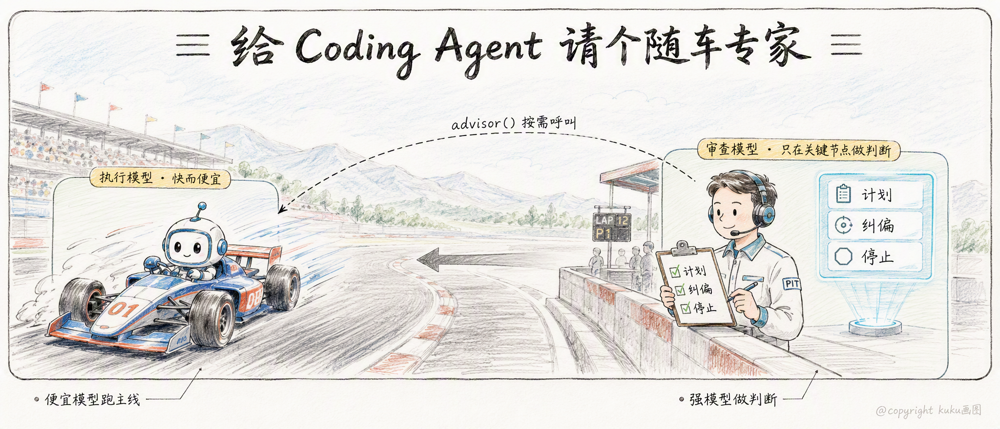
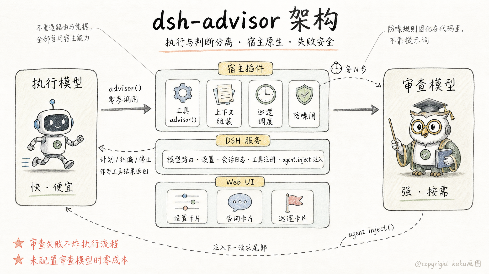
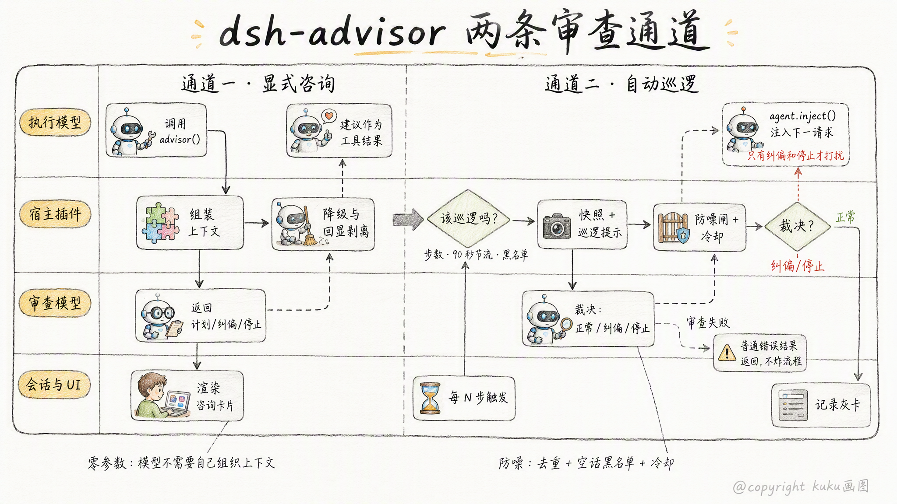
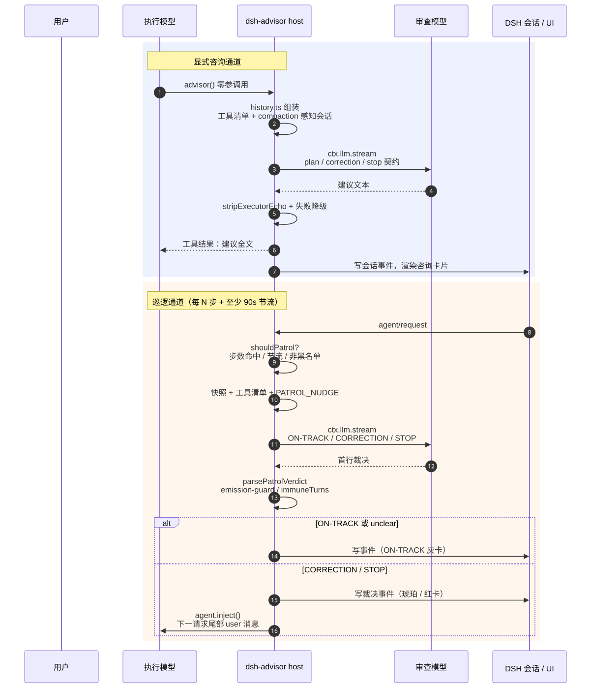
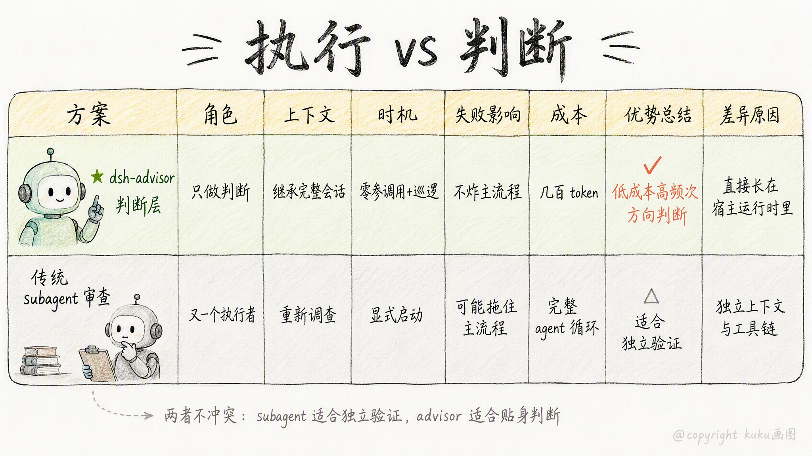

# DeepSeek Harness 插件实战：我给 Coding Agent 请了个“随车专家”

> **一句话**：让便宜模型干活，让强模型在关键节点做判断。

## 痛点：AI 不能既当选手又当裁判

你一定见过：模型写了一大段代码，测试没跑就说“完成了”；在同一个错误上转了三圈还在继续；明明已经跑偏，却越跑越自信。

问题不一定在模型不够强，而在结构：**它既当选手，又当裁判**。长链路 Coding Agent 里，三类失效反复出现：

| 失效模式 | 表现 |
|---|---|
| **自验证盲区** | 同一模型、同一上下文，既写代码又验代码，倾向于批准而不是挑战 |
| **长程漂移** | 会话一长，早期约束被工具结果淹没，开始改错文件、重复无效搜索 |
| **过早宣告完成** | 产物没落盘、测试没跑、边界没验，就说“完成了” |

于是我做了 `dsh-advisor-plugin`——一个 DeepSeek Harness 插件：执行模型继续用便宜快速的模型跑主线，遇到重大决策、反复卡住或准备宣告完成时，零参数调用 `advisor()`，把整段会话交给更强的审查模型，拿回计划、纠偏或停止信号。

**行业验证**：2026 年 4 月，Anthropic 把 advisor strategy 产品化为 API 的 advisor tool，并公布评测数据：**Sonnet 搭配 Opus advisor，SWE-bench Multilingual 比 Sonnet 单独跑提升 2.7 个百分点，单 agentic task 成本下降 11.9%**（[Anthropic: The advisor strategy](https://claude.com/blog/the-advisor-strategy)）。社区同方向探索还有 [rpiv-advisor](https://pi.dev/packages/@juicesharp/rpiv-advisor?name=review)、[oh-my-pi advisor-watchdog](https://github.com/can1357/oh-my-pi/blob/main/docs/advisor-watchdog.md)、[omdsh-dev/dsh-advisor](https://github.com/omdsh-dev/dsh-advisor)。

## 架构：执行与判断分离

核心思路：**不重造轮子，全部长在 DSH 的插件机制上**。DeepSeek Harness 的设计是“一切皆插件”：Cordis 提供依赖注入与插件运行时，主循环暴露 `agent/pre-step`、`agent/request`、`agent/request-error` 三个 waterfall 插桩点。dsh-advisor-plugin 因此可以只做自己擅长的事——

- 通过 `ctx.llm.stream` 复用 DSH 已配置的 provider 路由与凭据，**不需要 fork 宿主**；
- 模型路由、会话持久化、压缩、UI 宿主都由 DSH 提供，插件只专注“**何时审查、审查什么、如何投递、如何防噪**”。

精确到模块的架构分解图：

## 两条通道：主动求助 + 自动巡逻

**通道一 · 显式咨询**：执行模型在任务开始前、卡住时、证据矛盾时、宣告完成前，调用零参数 `advisor()`。调用即自动转发整段会话与工具清单，审查模型按 `plan / correction / stop` 契约回文，建议作为工具结果回到执行模型。零参数意味着模型不需要组织上下文，使用门槛最低。

**通道二 · 自动巡逻**：插件在 `agent/request` 上按步数和时间节流触发（每 N 步一次、两次至少间隔 90 秒）。裁决分 `ON-TRACK` / `CORRECTION` / `STOP`，只有后两者真正干预，且 `CORRECTION` 受 `patrolImmuneTurns` 冷却限制，避免连环打扰。

精确版时序图：

## 实现拆解：七条原则，以及它们是怎么落地的

| 设计原则 | 怎么实现的 |
|---|---|
| **① 执行与判断分离** | 执行模型跑主线；审查模型只按 `plan / correction / stop` 契约回文。不同模型、不同算力档位、不同角色契约 |
| **② 建议权 ≠ 执行权** | advisor 不批准、不拒绝、不改状态，建议作为普通工具结果返回，采纳权在执行模型与用户——`weigh, don't blindly obey` |
| **③ 按需升级，而非全程双模型** | `provider + model` 齐备才武装，未武装时工具与提示段都不注册，零成本；`disabledForModels` 支持 `model` / `provider/model` / `provider/model@effort` 三种黑名单语法 |
| **④ 信息保真优先** | `history.ts` 组装「工具清单 + `session.deriveMessages()`（compaction 感知）+ 尾部规则」，审查者看到的就是模型真正看到的；工具清单字节级稳定，命中前缀缓存；审查者可选 `search_files` / `read_file` 只读调查，工作区钳制 + realpath 防逃逸，先查证再下结论 |
| **⑤ 防御性工程** | effort 不支持→降级重试；上下文溢出→配对安全截断；空正文→有界重试；回显→剥离；防噪不靠提示词靠代码：归一化、空话黑名单、FIFO 4096 去重、纠偏冷却。**任何审查失败都作为普通工具结果返回，绝不炸掉执行 turn** |
| **⑥ 宿主原生** | 巡逻干预走 `agent.inject()` 落在下一请求尾部——注意力最集中的位置，且不破坏前缀缓存；代价是不能打断在飞 turn |
| **⑦ 人类可观测** | 咨询卡片、灰/琥珀/红三色巡逻卡片、设置页实时可调——审查不是黑盒 |

## 为什么不直接起一个 subagent 检查代码？

subagent 审查当然有用，但它和 advisor 解决的不是同一个问题：

| 维度 | 传统 subagent 审查 | dsh-advisor-plugin |
|---|---|---|
| 角色 | 又一个执行者：有上下文、有工具、要产出报告 | 判断层：只输出 plan / correction / stop，不碰代码 |
| 上下文 | fresh context 重新调查，或手动回灌主会话 | 直接继承压缩感知的完整会话与工具清单 |
| 时机 | 显式启动，启动本身有开销 | 关键节点零参数调用 + 后台巡逻 |
| 失败影响 | 子 Agent 失败/超时可能拖住主流程 | 审查失败作为普通工具结果返回，不炸执行 turn |
| 成本 | 完整 Agent + 工具循环 | 一次侧调用，通常只回几百 token，默认无工具 |

**subagent 像“再派一个人去现场调查”，advisor 像“把当前情况递给专家，让他给一句判断”。** 两者不冲突：subagent 适合独立验证和并行探索，advisor 适合低成本、高频次、贴近主循环的方向判断。

## 使用方式：给你的 Agent 配上审查模型

推荐在 DSH 里安装 `dsh-advisor-plugin`，配一个比执行模型更强的审查模型：

1. **设置页完成配置**：选择审查模型与推理档位，按需打开巡逻开关和只读调查工具。
2. **执行模型自动求助**：在任务开始前、卡住时、宣告完成前，执行模型会调用零参数 `advisor()`，会话流里出现专属咨询卡片。
3. **展开查看专家建议**：审查模型返回的 plan 全文作为工具结果回来。
4. **按建议收尾**：执行模型参考建议继续推进，工具卡片收回折叠态。
5. **审查失败也不影响干活**：即使审查调用失败（比如鉴权报错），也只是展示一张错误卡片，执行模型的 turn 不受任何影响。

**使用建议**：

- **长任务开巡逻**：短任务靠显式咨询就够；长链路任务建议打开自动巡逻，间隔按任务长度调；
- **重要交付前手动问一下**：合并、发布、删数据之前，主动让审查模型过一遍；
- **算力搭配**：执行模型选快而便宜的，审查模型选强的；已经很强的执行模型可以用黑名单跳过审查，不花冤枉钱；
- **嫌吵就调冷却**：巡逻太频繁时，调大巡逻间隔或纠偏冷却，只保留 STOP 级别的干预。

## 现在的局限

- **全量转发成本**：每次咨询/巡逻都把整段会话计费到审查模型，长会话尤其明显；
- **不能打断在飞行为**：干预最早落在下一个模型请求，对死循环的实时纠偏有限；
- **同上下文验证偏差**：审查者与执行者共享会话，仍可能继承其框架，只读调查只能部分缓解；
- **模型合规性依赖**：对“读了但不动”的模型，目前缺少硬中止手段；
- **不是 subagent 的替代品**：需要 fresh-context 独立验证时，subagent 仍更合适。

## 写在最后

dsh-advisor-plugin 真正做的事，是把 Agent 的**执行算力**和**判断算力**分开：执行模型便宜、快、上下文连续，负责推进；审查模型更强、更贵、按需调用，负责在关键节点做判断。

在模型能力继续提升的同时，这种“算力分配架构”不会过时——因为无论模型多强，**让谁在什么时候、以什么成本、看什么上下文、做什么判断**，始终是工程问题。

## 参考来源

- [Anthropic: The advisor strategy](https://claude.com/blog/the-advisor-strategy)
- [oh-my-pi Advisor, WATCHDOG.md, and WATCHDOG.yml](https://github.com/can1357/oh-my-pi/blob/main/docs/advisor-watchdog.md)
- [rpiv-advisor — Pi Coding Agent](https://pi.dev/packages/@juicesharp/rpiv-advisor?name=review)
- [rpiv-advisor README — juicesharp/rpiv-mono](https://github.com/juicesharp/rpiv-mono/tree/main/packages/rpiv-advisor)
- [omdsh-dev/dsh-advisor — 每轮被动审查路线](https://github.com/omdsh-dev/dsh-advisor)
- [DeepSeek Harness 架构深读：从源码看懂「一切皆插件」](https://github.com/deepseek-ai/deepseek-harness/discussions/1103)
